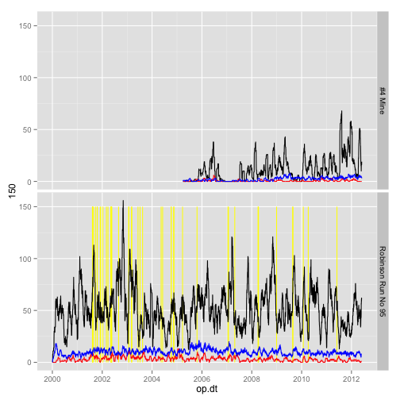
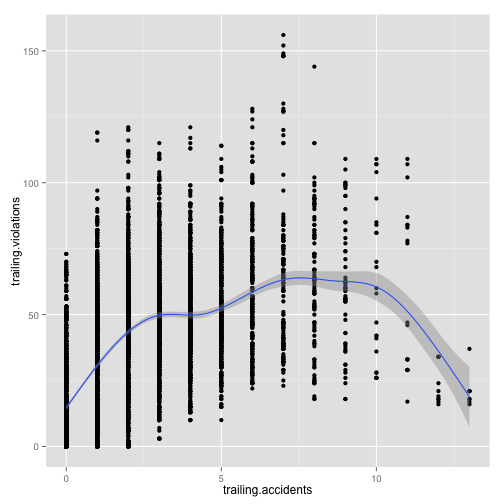
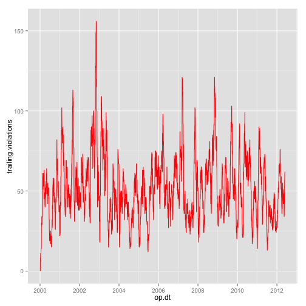

Analysis of MSHA Inspections, Violations, and Accident Data
========================================================

_An open and ongoing analysis of the data provided by the [US Mine Safety & Health Administration](http://www.msha.gov/OpenGovernmentData/OGIMSHA.asp). See [github.com/mwfrost/MSHA](https://github.com/mwfrost/MSHA) for details._


```r
require(reshape)
```

```
## Loading required package: reshape Loading required package: plyr
## 
## Attaching package: 'reshape'
## 
## The following object is masked from 'package:plyr':
## 
## rename, round_any
```

```r
require(plyr)
require(ggplot2)
```

```
## Loading required package: ggplot2
```

```r
require(lubridate)
```

```
## Loading required package: lubridate
## 
## Attaching package: 'lubridate'
## 
## The following object is masked from 'package:reshape':
## 
## stamp
## 
## The following object is masked from 'package:plyr':
## 
## here
```

```r
require(xtable)
```

```
## Loading required package: xtable
```

```r
require(scales)
```

```
## Loading required package: scales
```

```r
require(RJSONIO)
```

```
## Loading required package: RJSONIO
```

```r

setwd("~/Code/MSHA/")
source("./lib/calendarHeat.r")
Sys.setlocale(locale = "C")
```

```
## [1] "C/C/C/C/C/en_US.UTF-8"
```


### Utility scripts
(not run in this process)

Download the most recent files
`.\data\msha_source\download_source.sh`

Unzip the files, replacing the old copies
`\data\msha_source\unzip_source.sh\`

Use the python `pandas` library to select and write out files small enough for R to handle gracefully.
`.\extract_wv.py`


```r
mdat <- read.csv("data/wv_mines.csv")
vdat <- read.csv("data/wv_violations.csv")
idat <- read.csv("data/wv_inspections.csv")
adat <- read.csv("data/wv_accidents.csv")
```


```r

mdat$current.status.dt <- mdy(as.character(mdat$CURRENT_STATUS_DT))
vdat$violation.occur.dt <- mdy(as.character(vdat$VIOLATION_OCCUR_DT))

idat$inspection.begin.dt <- ymd(gsub("-", "/", gsub(" 00:00:00", "", idat$INSPECTION_BEGIN_DT)))
adat$accident.dt <- ymd(gsub("-", "/", gsub(" 00:00:00", "", adat$ACCIDENT_DT)))
```


```r

trailing.events <- function(mine, acc.dt = now(), trailing.days = 90) {
    d <- data.frame(mine, acc.dt)
    ddply(d, .(mine, acc.dt), function(x) {
        c(trailing.accidents = nrow(subset(adat, MINE_ID == x$mine & accident.dt < 
            x$acc.dt & accident.dt > x$acc.dt - ddays(trailing.days))), trailing.violations = nrow(subset(vdat, 
            MINE_ID == x$mine & violation.occur.dt < x$acc.dt & violation.occur.dt > 
                x$acc.dt - ddays(trailing.days))), trailing.injuries = sum(subset(vdat, 
            MINE_ID == x$mine & violation.occur.dt < x$acc.dt & violation.occur.dt > 
                x$acc.dt - ddays(trailing.days))$NO_INJURIES, na.rm = TRUE), 
            trailing.lost.days = sum(subset(vdat, MINE_ID == x$mine & violation.occur.dt < 
                x$acc.dt & violation.occur.dt > x$acc.dt - ddays(trailing.days))$DAYS_LOST, 
                na.rm = TRUE), trailing.inspections = nrow(subset(idat, MINE_ID == 
                x$mine & inspection.begin.dt < x$acc.dt & inspection.begin.dt > 
                x$acc.dt - ddays(trailing.days))))
    })
}

# Tests trailing.events(c(4601318, 4601456) , ymd(c('2005-09-08',
# '2011-08-05')), 30)

# trailing.events(adat[1:10,'MINE_ID'], adat[1:10, 'accident.dt'], 30)
```


Every day of operation for every mine needs a record, so we can try to identify any differences between the days without accidents and those with. We don't have the full span of operating days, though. One way to fake it is to run the span between the first and last recorded inspections for each mine


```r

# x is the data frame of inspections
fill.days <- function(x) {
    data.frame(mine = x$MINE_ID[1], mine.day = seq(min(x$inspection.begin.dt), 
        max(x$inspection.begin.dt), by = "day"))
}
# Tests fill.days(idat[idat$MINE_ID==4609060,])

# by(idat[idat$MINE_ID %in% c(4609060,4601318),], idat[idat$MINE_ID %in%
# c(4609060,4601318),'MINE_ID'], fill.days)

mine.days <- ddply(idat, .(MINE_ID), fill.days)
mine.days$mine <- NULL

```


Now that there's a unique record for every day of operation (sort of), calculate the trailing accidents, violations, and inspections for each mine/day, then join all the accident records to determine which days involved accidents.

TODO: currenty ignoring the problems caused by multiple accidents per day

TODO: This step could probably be much faster as a pandas aggregation pipeline.


```r
head(trailing.events(mine.days[1:10, "MINE_ID"], mine.days[1:10, "mine.day"], 
    30))
```

```
##     mine     acc.dt trailing.accidents trailing.violations
## 1 504775 2004-01-20                  0                   0
## 2 504775 2004-01-21                  0                   0
## 3 504775 2004-01-22                  0                   0
## 4 504775 2004-01-23                  0                   0
## 5 504775 2004-01-24                  0                   0
## 6 504775 2004-01-25                  0                   0
##   trailing.injuries trailing.lost.days trailing.inspections
## 1                 0                  0                    0
## 2                 0                  0                    1
## 3                 0                  0                    1
## 4                 0                  0                    1
## 5                 0                  0                    1
## 6                 0                  0                    1
```

```r

mine.day.stats <- trailing.events(mine.days[mine.days$MINE_ID %in% c(4609060, 
    4601318), "MINE_ID"], mine.days[mine.days$MINE_ID %in% c(4609060, 4601318), 
    "mine.day"], 30)
# acc.dt is now op.dt
names(mine.day.stats) <- gsub("acc.dt", "op.dt", names(mine.day.stats))

mine.day.stats <- merge(mine.day.stats, adat[, c("MINE_ID", "accident.dt", "DEGREE_INJURY_CD", 
    "CLASSIFICATION")], by.x = c("mine", "op.dt"), by.y = c("MINE_ID", "accident.dt"), 
    all.x = TRUE)

head(subset(mine.day.stats, !is.na(DEGREE_INJURY_CD)))
```

```
##       mine      op.dt trailing.accidents trailing.violations
## 51 4601318 2000-02-23                  0                  57
## 57 4601318 2000-02-29                  1                  54
## 78 4601318 2000-03-21                  2                  46
## 79 4601318 2000-03-21                  2                  46
## 83 4601318 2000-03-25                  3                  49
## 84 4601318 2000-03-26                  4                  49
##    trailing.injuries trailing.lost.days trailing.inspections
## 51                 0                  0                   18
## 57                 0                  0                   17
## 78                 0                  0                    9
## 79                 0                  0                    9
## 83                 0                  0                    7
## 84                 0                  0                    7
##    DEGREE_INJURY_CD         CLASSIFICATION
## 51                0             ENTRAPMENT
## 57                6  HANDLING OF MATERIALS
## 78                3 SLIP OR FALL OF PERSON
## 79                3  HANDLING OF MATERIALS
## 83                6  HANDLING OF MATERIALS
## 84                0   FALL OF ROOF OR BACK
```


Join some useful categories to the per mine/day stats and flag accident days


```r
mine.day.stats <- merge(mine.day.stats, mdat[, c("MINE_ID", "CURRENT_MINE_NAME", 
    "COAL_METAL_IND", "CURRENT_OPERATOR_NAME", "CURRENT_CONTROLLER_NAME", "STATE", 
    "FIPS_CNTY_NM", "NO_EMPLOYEES")], by.x = c("mine"), by.y = c("MINE_ID"))
mine.day.stats$bin.inj <- ifelse(is.na(mine.day.stats$DEGREE_INJURY_CD), 0, 
    1)
mine.day.stats$bin.acc <- ifelse(is.na(mine.day.stats$CLASSIFICATION), 0, 1)

head(subset(mine.day.stats, p.acc == 1))
```

```
## Error: object 'p.acc' not found
```


```r
table(mine.day.stats$CLASSIFICATION)
```

```
## 
##      ALL OTHER OCCUPATIONAL ILLNESSES 
##                                     2 
##           DISORDERS (PHYSICAL AGENTS) 
##                                     0 
##           DISORDERS (REPEATED TRAUMA) 
##                                    57 
##                 DUST DISEASE OF LUNGS 
##                                    14 
##                            ELECTRICAL 
##                                     4 
##                            ENTRAPMENT 
##                                    11 
##      EXPLODING VESSELS UNDER PRESSURE 
##                                     2 
##        EXPLOSIVES AND BREAKING AGENTS 
##                                     0 
## FALL OF FACE/RIB/PILLAR/SIDE/HIGHWALL 
##                                     6 
##                  FALL OF ROOF OR BACK 
##                                    44 
##     FALLING/SLIDING/ROLLING MATERIALS 
##                                     6 
##                                  FIRE 
##                                     3 
##                 HANDLING OF MATERIALS 
##                                   135 
##                HANDTOOLS (NONPOWERED) 
##                                    39 
##                              HOISTING 
##                                    41 
##  IGNITION OR EXPLOSION OF GAS OR DUST 
##                                    45 
##                           IMPOUNDMENT 
##                                     0 
##                            INUNDATION 
##                                     2 
##                             MACHINERY 
##                                    43 
##                    NONPOWERED HAULAGE 
##                                     2 
##            OCCUPATIONAL SKIN DISEASES 
##                                     0 
##                                 OTHER 
##                                     3 
##           POISONING (TOXIC MATERIALS) 
##                                     0 
##                       POWERED HAULAGE 
##                                    21 
## RESPIRATORY CONDITIONS (TOXIC AGENTS) 
##                                     0 
##                SLIP OR FALL OF PERSON 
##                                    71 
##        STEPPING OR KNEELING ON OBJECT 
##                                     4 
##                   STRIKING OR BUMPING 
##                                     7
```

```r

ggplot(mine.day.stats) + geom_segment(data = mine.day.stats[mine.day.stats$bin.acc == 
    1 & grepl("FIRE |IGNITION", mine.day.stats$CLASSIFICATION), ], aes(x = op.dt, 
    xend = op.dt, y = 150, yend = 0), color = "yellow") + geom_line(aes(x = op.dt, 
    y = trailing.violations)) + geom_line(aes(x = op.dt, y = trailing.accidents), 
    color = "red") + geom_line(aes(x = op.dt, y = trailing.inspections), color = "blue") + 
    facet_grid(CURRENT_MINE_NAME ~ .)
```

 

```r

ggplot(mine.day.stats) + geom_point(aes(x = trailing.accidents, y = trailing.violations)) + 
    stat_smooth(aes(x = trailing.accidents, y = trailing.violations))
```

```
## geom_smooth: method="auto" and size of largest group is >=1000, so using
## gam with formula: y ~ s(x, bs = "cs"). Use 'method = x' to change the
## smoothing method.
```

 

```r

ggplot(mine.day.stats[mine.day.stats$mine == 4601318, ]) + geom_line(aes(x = op.dt, 
    y = trailing.violations), color = "red")
```

 


```r
logit.acc <- glm(bin.acc ~ trailing.accidents + trailing.violations + trailing.inspections, 
    data = mine.day.stats, family = "binomial")
summary(logit.acc)
```

```
## 
## Call:
## glm(formula = bin.acc ~ trailing.accidents + trailing.violations + 
##     trailing.inspections, family = "binomial", data = mine.day.stats)
## 
## Deviance Residuals: 
##    Min      1Q  Median      3Q     Max  
## -0.867  -0.458  -0.363  -0.254   2.738  
## 
## Coefficients:
##                      Estimate Std. Error z value Pr(>|z|)    
## (Intercept)          -3.72566    0.11650  -31.98  < 2e-16 ***
## trailing.accidents    0.09138    0.02083    4.39  1.2e-05 ***
## trailing.violations   0.00489    0.00220    2.22    0.026 *  
## trailing.inspections  0.09713    0.01431    6.79  1.1e-11 ***
## ---
## Signif. codes:  0 '***' 0.001 '**' 0.01 '*' 0.05 '.' 0.1 ' ' 1
## 
## (Dispersion parameter for binomial family taken to be 1)
## 
##     Null deviance: 3945.4  on 7198  degrees of freedom
## Residual deviance: 3734.9  on 7195  degrees of freedom
## AIC: 3743
## 
## Number of Fisher Scoring iterations: 6
```

```r
confint(logit.acc)
```

```
## Waiting for profiling to be done...
```

```
##                           2.5 %   97.5 %
## (Intercept)          -3.9587570 -3.50195
## trailing.accidents    0.0501173  0.13183
## trailing.violations   0.0005421  0.00916
## trailing.inspections  0.0690418  0.12514
```

